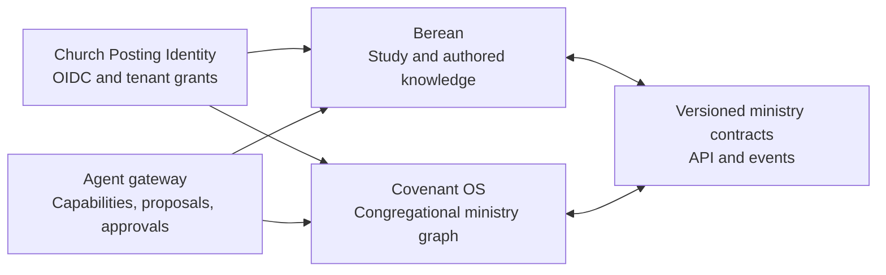

> Copied from covenantOS/churchposting-app-backup revision 460c77bb82901f39244acd6028547f51e73b4aed (docs/BEREAN_INTEGRATION_BRIEF.md). That revision remains the source of truth for the cross-product contract.

# Berean and Covenant OS Integration Brief

_Prepared July 17, 2026 from the earlier `berean-plan.docx`. Berean remains a working name and a future sibling product. This document exists so a separate implementer can begin intelligently without coupling Berean to unfinished Covenant OS code._

## Start here

Before building Berean, read:

1. [`PRODUCT_DOCTRINE.md`](./PRODUCT_DOCTRINE.md) - the ministry model Covenant OS is being rebuilt around.
2. [`COVENANT_DESIGN_LANGUAGE.md`](./COVENANT_DESIGN_LANGUAGE.md) - the shared product-family design standard.
3. [`LAUNCH_PLAN.md`](./LAUNCH_PLAN.md) - current platform, identity, Cloudflare, Neon, and launch direction.
4. `src/lib/agent/policy.ts` and `src/app/api/ai/chat/route.ts` - the current bounded action/approval model. This code will evolve, but its security posture is intentional.
5. `src/app/(dashboard)/worship/page.tsx` and `src/app/(dashboard)/worship/plans/[id]/page.tsx` - the first Covenant OS vertical slice that Berean will eventually integrate with.

Do not treat the inherited app schema or current UI as a final Berean API. The integration contracts below are the intended seam.

## Product relationship

Church Posting is the company. Covenant OS and Berean are sibling products.

- **Covenant OS** owns the congregation's operational ministry graph: people, households, offices, permissions, services, assignments, groups, giving, communications, kids, events, websites, and publication state.
- **Berean** owns Scripture study and authored knowledge: passages, reading state, private marginalia, research projects, sources and citations, sermon preparation, teaching/writing artifacts, and personal study calendars.
- Each product must be excellent and useful alone.
- The integration follows real church work from study to gathered worship to the congregation. It is not a bundle banner or a shared sidebar.
- Neither application reads or writes the other application's database.



## What is strong in the old plan

Preserve these convictions:

- Scripture-first study ordered toward worship, preaching, teaching, writing, family life, and the church body.
- Worship as the complete Lord's Day service rather than a set list.
- A quiet, serious interface without streaks, badges, confetti, or an attention economy.
- Research that opens to real sources and never hides unsupported synthesis behind AI prose.
- The preacher remains the preacher. AI prepares a study, finds and compares sources, tests claims, and helps organize; it does not assume ministerial authority.
- Private notes and authored work belong to the user.
- Open-source and hosted-service possibilities deserve serious exploration.
- The pulpit-to-pew-to-household loop is the central integration opportunity.

## What must change before implementation

### 1. Rooms are a metaphor, not six data silos

The Chapel, Reading Desk, Library, Writing Desk, Pulpit, and Almanac are powerful brand language. They should not become six disconnected products with duplicated notes, passages, calendars, or AI context.

Build one knowledge graph with contextual workspaces:

- passage and canon references;
- sources, editions, licenses, and citations;
- notes and annotations;
- projects and authored documents;
- sermons, lessons, liturgies, and reading plans;
- calendars and due work; and
- proposals, approvals, revisions, and provenance.

A note can appear at the Reading Desk and Pulpit because it is one note with explicit links and visibility, not because two modules copied it.

### 2. Broaden the market language without losing conviction

The old plan's references to a fog machine, Christian nationalism, or a particular orbit are too narrow and combative for product requirements. The primary audience remains tradition-minded, confessional, Reformed, Presbyterian, Lutheran, Baptist, Anglican, Sovereign Grace, and adjacent churches, while serious Bible-believing readers outside those labels should not encounter needless exclusion.

Support church and household convictions through profiles, vocabulary, permissions, and defaults. Do not encode a culture-war taxonomy into the account model.

### 3. Do not prescribe disputed scholarship as hidden platform truth

Text traditions, canon, translation philosophy, Septuagint use, lectionaries, confessions, sacraments/ordinances, and polity require visible configuration and qualified editorial review. Berean may present evidence and tradition-specific defaults. It must not silently turn a contested claim from the vision document into a universal algorithm.

### 4. Replace "learns everything" with governed memory

The Scribe may learn preferences only through explicit, inspectable scopes:

- user-selected confession and doctrinal profile;
- translation and source preferences;
- opted-in writing samples or prior sermons;
- church-shared liturgies and repertoire the user may access; and
- corrections the user chooses to retain.

Every memory needs origin, scope, visibility, last use, edit/delete controls, and export. Private marginalia, prayers, drafts, counseling material, or family notes never become church-wide context by inference.

### 5. Licensing is a core system, not a later content task

Bible translations, original-language editions, lexicons, modern commentaries, hymnals, tunes, sheet music, recordings, and typography may all carry separate rights. Every resource needs:

- rights holder and source;
- license type and territory;
- allowed presentation, search, quotation, export, AI indexing, and offline use;
- expiry/version state; and
- a safe fallback when a user or church lacks access.

Never imply that Sing! Hymnal, a modern translation, a commentary, or musical engraving is included until a signed license permits the exact use.

### 6. Open source and pricing remain hypotheses

Berean now has a product direction of community self-hosting plus a genuinely useful hosted free plan, with paid supported hosting, compute-heavy AI, collaboration, storage, and licensed resources. The shared commercial and trust contract lives in [`COMMERCIAL_MODEL.md`](./COMMERCIAL_MODEL.md). The exact license, governance, allowances, prices, inference economics, and licensed-resource model still require ownership, cost, and legal validation before public promises. Keep the architecture portable and inspectable.

## Canonical ownership

| Concept                                    | Canonical owner                       | May be mirrored                                            | Rule                                                   |
| ------------------------------------------ | ------------------------------------- | ---------------------------------------------------------- | ------------------------------------------------------ |
| User identity                              | Church Posting Identity               | both                                                       | stable subject ID; no password sharing                 |
| Church, household, member, office, role    | Covenant OS                           | Berean receives authorized references                      | Berean never becomes a shadow CHMS                     |
| Private reading state and marginalia       | Berean                                | no church mirror by default                                | user-owned and private unless explicitly shared        |
| Passage and source identity                | Berean contracts/catalog              | Covenant OS stores stable references and display snapshots | edition/version always included                        |
| Sermon study project and research          | Berean                                | Covenant OS receives publication artifact/status           | drafts remain private to authorized collaborators      |
| Sermon event in an order of worship        | Covenant OS                           | Berean links to it                                         | Covenant owns date, service, assignment, and readiness |
| Order of worship and assignments           | Covenant OS                           | Berean receives a working projection                       | Covenant is authoritative for service operations       |
| Proposed liturgy                           | Berean until accepted                 | Covenant stores accepted revision                          | proposal never overwrites an order silently            |
| Hymn/song resource metadata                | provider/catalog plus product records | both by stable reference                                   | licensing and arrangement rights travel with reference |
| Published sermon/media page                | Covenant OS                           | Berean links to publication                                | publication requires authorized human action           |
| Church-wide reading/catechesis appointment | Covenant OS                           | Berean delivers study experience                           | elders/staff appoint; Berean records private progress  |
| Group discussion material                  | Covenant OS after approval            | Berean authors draft                                       | group leaders receive approved revision only           |

## Identity and tenancy

Target a shared first-party identity issuer using OIDC/OAuth 2.1 semantics. Do not solve single sign-on by sharing session cookies or database tables.

Required claims and grants:

- stable `subject_id` for a person;
- `church_id` only when acting in an authorized church context;
- role/office-derived capability grants rather than broad labels alone;
- explicit personal, household, church, and public scopes;
- short-lived access tokens with audience restriction;
- revocable refresh/session state; and
- audit records for cross-product access.

A pastor may have a personal Berean account before a church adopts Covenant OS. Joining a church links the stable subject to a Covenant person record through an invitation and an explicit grant. Leaving staff or a church revokes church access without deleting personal study work.

## Integration transport

Use versioned APIs for commands and signed events for facts. Cloudflare Queues can carry asynchronous events; direct service APIs handle interactive commands. Neon remains each product's Postgres system of record, with separate databases/projects or strictly independent schemas and credentials. R2 can hold exported artifacts and media using short-lived signed access.

Every cross-product command/event includes:

```json
{
  "contractVersion": "1.0",
  "eventId": "uuid",
  "eventType": "berean.sermon.publication_proposed",
  "occurredAt": "ISO-8601",
  "actorSubjectId": "stable-subject-id",
  "churchId": "uuid",
  "correlationId": "uuid",
  "idempotencyKey": "stable-key",
  "source": "berean",
  "data": {}
}
```

Rules:

- at-least-once delivery, idempotent consumers;
- per-church authorization on every command;
- schema validation at both boundaries;
- no raw provider, Cloudflare, Neon, or model credentials cross products;
- no secrets or private document contents in event metadata/logs;
- replay/dead-letter tooling and visible failure state; and
- immutable audit receipt linking proposal, approval, execution, and resulting revision.

## First contract set

Names are provisional; behavior is not.

### Covenant OS to Berean

- `covenant.service.created|updated` - date, service pattern, sermon element, assigned preacher.
- `covenant.sermon.assignment.created|updated` - preacher, passage/series appointment, due dates.
- `covenant.service.order_changed` - accepted order revision and public/staff fields Berean may use.
- `covenant.reading_plan.appointed` - church-wide plan, audience, dates, authorized leader.
- `covenant.group.curriculum_requested` - approved need for discussion/study material.
- `covenant.access.revoked` - immediately remove church context and tokens.

### Berean to Covenant OS

- `berean.sermon.study_started` - readiness only; no private notes.
- `berean.sermon.publication_proposed` - title, passage, summary, approved artifact references, requested destinations.
- `berean.liturgy.proposed` - complete proposed order revision with sources and rationale.
- `berean.service.resources_proposed` - readings, hymns/psalms, keys, files, and rights metadata.
- `berean.group.material.proposed` - questions or lesson artifact for human review.
- `berean.reading_plan.content_updated` - versioned content update, never a silent appointment change.

Do not emit granular "user read verse" or private note events to Covenant OS. Aggregated progress may be shared only when a user knowingly participates in a church plan and the exact visibility is explained.

## End-to-end integration flows

### Appointed text to order of worship

1. An authorized leader assigns a preacher and passage in Covenant OS.
2. Berean creates or links a sermon study project for that preacher.
3. The Scribe prepares a cited research brief; it does not publish or write a final sermon.
4. Berean may propose related readings, prayers, psalms/hymns, or a complete liturgy using church preferences and licensed resources.
5. Covenant OS displays a diff against the current order of worship.
6. An authorized leader accepts selected elements. Covenant creates a new order revision and assigns people/roles.
7. Changes after acceptance remain separate revisions; neither app silently overwrites the other.

### Finished sermon to congregation

1. The preacher marks an authored artifact ready to propose.
2. Berean sends only approved manuscript/summary/media references and provenance.
3. Covenant OS prepares destinations: sermon archive, website, member app, email, groups, or social.
4. A human reviews audience, wording, rights, and schedule.
5. Covenant publishes and returns canonical public URLs/status.
6. Berean links the private study project to the public result without making private notes public.

### Church reading and catechesis

1. Elders or authorized leaders appoint a plan and audience in Covenant OS.
2. Berean supplies versioned reading/catechesis content and its study interface.
3. Covenant distributes invitations and shows the plan in the member context.
4. Each member controls private notes and understands any shared progress.
5. Group or household material can be proposed from the same plan and approved separately.

## Agent and MCP model

Berean's Scribe and Covenant OS's ChurchBot should eventually use one provider-neutral capability protocol, while retaining different character and tools.

- **Scribe**: evidence gathering, cited synthesis, textual comparison, research organization, editorial critique, and proposals into church workflows.
- **ChurchBot**: ministry operations, canonical people/service/group objects, provider-backed execution, cross-product coordination, and approvals.

Shared requirements:

1. Server-side capability registry is the authority; prompt text never grants access.
2. Read and write scopes are separate and tenant-bound.
3. Consequential writes produce a typed proposal/diff and require an exact-action approval receipt.
4. Calls have size, iteration, time, and cost budgets.
5. Execution is idempotent and returns provider truth; agents never claim unverified success.
6. Church/member data is untrusted input, not agent instructions.
7. Citations include source, edition, location, quote bounds, and retrieval/version metadata.
8. Memory is scoped, inspectable, exportable, and deletable.
9. External clients such as Claude, Codex, or ChatGPT receive OAuth grants and MCP capabilities, never raw infrastructure keys.

The initial Covenant implementation in `src/lib/agent/policy.ts` demonstrates allowlisted endpoints, budgets, approval methods, exact-action fingerprints, expiry, and single-use receipts. Berean should improve the contract, not replace it with a free-form tool proxy.

## Revised build order

The old four-phase roadmap delays integration too long and attempts too much content breadth in the first release. Build complete vertical jobs with legal content available from day one.

### Foundation: contracts, rights, and reader

- identity subject and personal/church scope model;
- canonical passage/source/edition identifiers;
- rights and provenance registry;
- beautiful Scripture reader using content Berean may legally ship;
- private marginalia with export/delete;
- cited source viewer; and
- shared design tokens implemented natively in Berean.

### First useful pastoral job: appointed text to cited brief

- sermon project linked to a passage;
- research shelf and citation graph;
- original-language apparatus only to the depth supported by verified datasets;
- Scribe brief with claim-to-source traceability;
- preacher-authored notes/outline; and
- no Covenant dependency required.

### First integration proof: appointed text to accepted service revision

- Covenant sermon assignment event;
- Berean project link;
- proposed readings/music/liturgy with sources and rights;
- Covenant diff, approval, revision, roles, print/public outputs; and
- audit/retry/idempotency tests.

This proves the family thesis earlier than building a giant Writing Desk or personal rule-of-life system.

### Expansion

- sermon archive and controlled publication;
- writing/editorial workflows;
- church reading and catechesis;
- group material;
- family/household experiences; and
- broader licensed library and original-language depth.

Almanac/rule-of-life features should follow demonstrated demand and pastoral/privacy review. They are not required to prove Berean.

## Claude implementation handoff

When starting the Berean repository:

1. Keep it a separate repository and deployable application.
2. Copy this document and the design-language document into its own docs, preserving a link back to the Covenant OS source revision.
3. Write a short architecture decision record for framework, Cloudflare runtime, Neon boundary, identity placeholder, and content licensing assumptions before scaffolding features.
4. Create versioned contract schemas and fixtures before any cross-product endpoint.
5. Build the reader and one cited-brief vertical slice; do not scaffold six empty rooms.
6. Implement private/personal/church/public visibility in the data model from the beginning.
7. Use only content with documented rights. Seed metadata must include source and license.
8. Preserve claim-level citation/provenance through AI prompts, storage, UI, export, and evaluation.
9. Add adversarial tests for fabricated citations, cross-tenant access, prompt injection in sources, revoked grants, replayed events, and unintended publication.
10. Do not modify Covenant OS integration code until the versioned contract proposal can be reviewed here.

## Open decisions for the owner

- Final product name and domain presentation (`Berean`, `Berean Bible`, or another name).
- Exact open-source license, hosted/self-hosted support promise, and repository governance.
- Bible text, original-language datasets, lexicons, commentaries, hymnals, and font licenses for the first legal release.
- Identity issuer and whether consumer Berean accounts exist independently before shared SSO launches.
- Initial Scribe inference provider, privacy terms, opt-in training/memory policy, and cost ceilings.
- Whether family worship and rule-of-life features belong in the first consumer product or later.
- Commercial packaging after real inference, storage, licensing, and support costs are measured.

None of these open decisions prevents building the rights registry, private reader, cited research graph, design system, and contract fixtures correctly.
